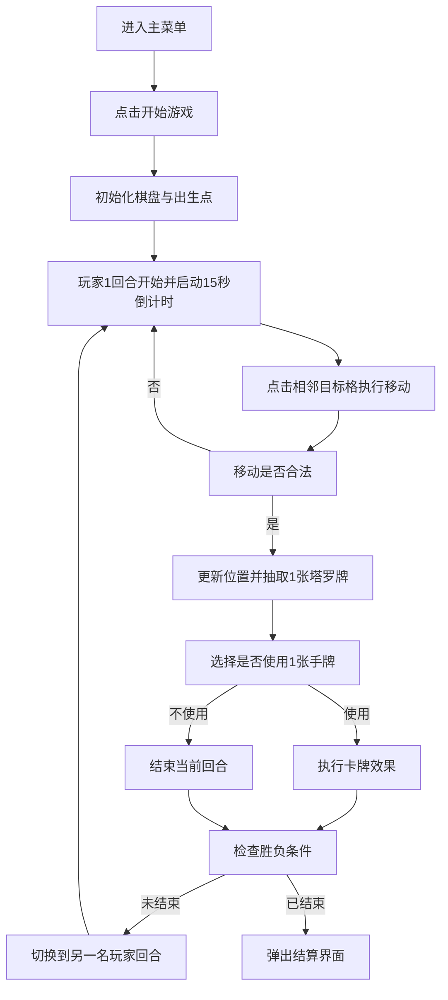

## 1. 产品概述
一款面向移动端的双人回合制策略对战游戏，核心玩法围绕 10x10 棋盘走位、空间封锁与塔罗牌技能博弈展开。
- 目标用户为偏好轻中度竞技、短局对战、强博弈感玩法的手游玩家。
- 产品价值在于用简洁规则构建高复玩性对局，形成“移动即资源、卡牌改写局势、封路决定胜负”的核心体验。

## 2. 核心功能

### 2.1 用户角色
当前版本仅包含单一玩家角色，无账号权限差异。

| 角色 | 进入方式 | 核心权限 |
|------|----------|----------|
| 普通玩家 | 进入游戏后开始对局 | 发起对局、执行移动、使用塔罗牌、查看结算 |

### 2.2 功能模块
1. **主菜单页**：开始游戏、规则入口、后续扩展入口。
2. **对战页**：10x10 棋盘、角色位置、障碍物、回合计时、手牌区、行动反馈。
3. **结算弹窗**：胜负结果、时长、双方用牌数量、获胜原因、再来一局、返回主菜单。

### 2.3 页面明细
| 页面名称 | 模块名称 | 功能描述 |
|-----------|-------------|---------------------|
| 主菜单页 | 标题区 | 展示游戏名、副标题、开始按钮 |
| 主菜单页 | 规则提示区 | 显示简版规则和操作提示 |
| 对战页 | 棋盘区 | 渲染 10x10 六边形外观棋盘，支持点击格子执行行动 |
| 对战页 | 玩家信息区 | 显示当前回合、剩余时间、双方手牌数、双方卡牌使用数 |
| 对战页 | 手牌区 | 展示当前玩家可用卡牌，支持点击选中与取消 |
| 对战页 | 操作反馈层 | 高亮可移动格、技能目标格、非法操作提示、胜负提示 |
| 对战页 | 回合控制区 | 展示回合倒计时与结束回合状态 |
| 结算弹窗 | 结果摘要 | 展示胜者、败者、获胜原因、本局时长 |
| 结算弹窗 | 数据战报 | 展示双方移动次数、用牌次数、剩余手牌 |
| 结算弹窗 | 操作按钮 | 支持“再来一局”和“返回主菜单” |

## 3. 核心流程
玩家从主菜单进入对局后，系统初始化 10x10 棋盘与双方出生点。每回合当前玩家有 15 秒完成 1 次移动，并在移动后选择是否使用 1 张塔罗牌。合法移动会立即发放 1 张随机卡牌，若手牌已满则自动丢弃。系统在每次移动、技能结算与回合结束后检查胜负条件，当某一方周围 8 格全部不可进入或因状态影响完整 1 回合无法行动时，游戏结束并显示结算弹窗。

## 4. 用户界面设计
### 4.1 设计风格
- 主色：深夜蓝黑、石板灰、象牙白
- 强调色：琥珀金、猩红、冰青，用于回合状态、危险提示和卡牌高亮
- 按钮风格：圆角胶囊按钮，轻微浮层阴影，点击时有压缩反馈
- 字体建议：标题使用有仪式感的衬线体，正文使用清晰的无衬线体
- 布局风格：移动端优先的纵向布局，棋盘居中，信息区上下分层
- 图标建议：采用神秘学、罗盘、星象、沙漏等视觉元素

### 4.2 页面设计概览
| 页面名称 | 模块名称 | UI 元素 |
|-----------|-------------|-------------|
| 主菜单页 | 标题区 | 大标题、塔罗纹样背景、开始按钮、规则摘要 |
| 对战页 | 棋盘区 | 六边形视觉格、角色棋子、障碍物标记、技能范围高亮 |
| 对战页 | 顶部信息栏 | 当前玩家、倒计时、双方状态、胜负预警 |
| 对战页 | 底部手牌栏 | 4 格手牌槽、选中描边、禁用态遮罩 |
| 对战页 | 操作反馈层 | 绿色可移动高亮、红色非法提示、风暴范围脉冲动画 |
| 结算弹窗 | 数据卡片 | 胜负标题、战报数据、操作按钮、重新开局动效 |

### 4.3 响应式设计
- 采用移动端优先设计，目标屏宽覆盖 360px 至 430px 主流手机尺寸。
- 棋盘区域保持固定比例，超小屏时通过缩放而非遮挡解决布局问题。
- 顶部信息栏和底部手牌栏保持安全区内显示，避免误触和遮挡。
- 所有关键点击区最小触控面积不低于 40px。

### 4.4 场景与动效指引
- 棋盘背景采用暗色渐变与微弱颗粒纹理，营造占卜战场氛围。
- 当前玩家回合开始时，棋盘边缘出现短暂扫光动画。
- 可移动格使用柔和呼吸光，高危险状态使用红色跳动边框。
- 抽牌、出牌、交换、风暴打乱需有明确动效，确保状态变化可理解。
- 结算弹窗出现时，背景轻度模糊，结果卡片自下而上弹入。

## 5. 初版规则参数
- 棋盘尺寸：10x10
- 格子表现：六边形外观
- 底层邻接：八方向方格逻辑
- 回合时限：15 秒
- 每回合动作：先移动，后可选择出 1 张牌
- 合法移动奖励：抽取 1 张随机塔罗牌
- 手牌上限：4 张
- 基础卡牌：障碍卡、圣杯卡、风暴卡
- 掉落概率：障碍卡 30%，圣杯卡 20%，风暴卡 20%，预留扩展池 30%
- 胜利条件：对手周围 8 格全部不可进入，或完整 1 回合无法行动

## 6. 版本范围
- 初版实现本地双人对战，不接入联网、账号、排行榜。
- 初版优先完成单页可玩原型，确保规则完整可验证。
- 后续再扩展更多塔罗牌、状态效果、AI 对手、联网匹配与商业化模块。
