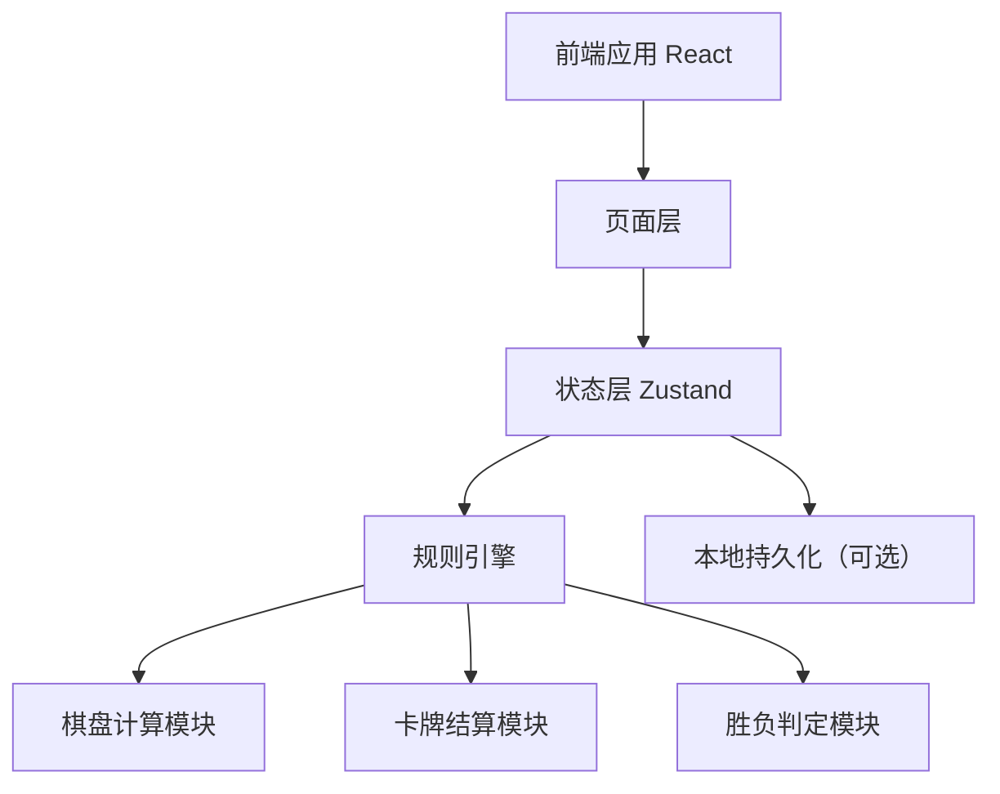
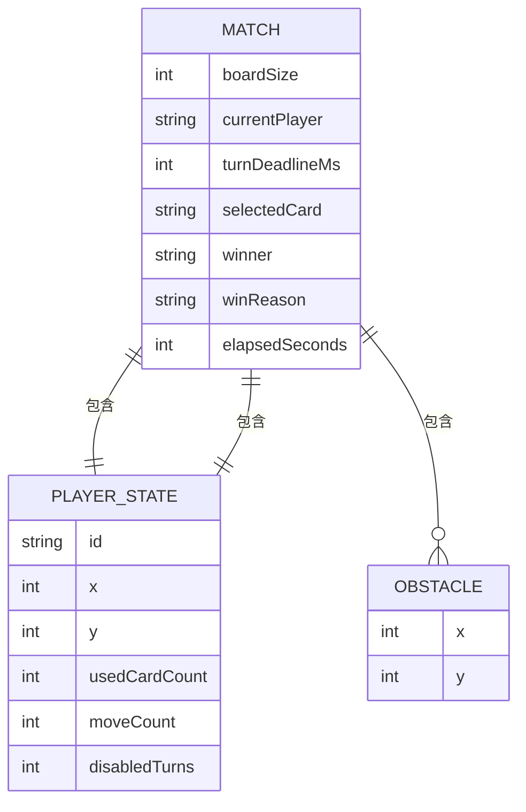

## 1. 架构设计


## 2. 技术说明
- 前端：React 18 + TypeScript + Vite + Tailwind CSS + Zustand
- 初始化工具：vite-init
- 渲染策略：单页应用，本地状态驱动，无后端依赖
- 数据存储：初版以内存状态为主，可选 localStorage 保存最近一局
- 测试方案：Vitest + React Testing Library

## 3. 路由定义
| 路由 | 用途 |
|-------|---------|
| / | 主菜单页与规则入口 |
| /battle | 对战主界面 |

## 4. API 定义
初版不包含服务端 API。所有游戏状态、规则计算、回合轮换与卡牌结算均在前端本地完成。

### 4.1 核心 TypeScript 类型
```ts
type PlayerId = 'player1' | 'player2'

type CellOccupant = 'empty' | 'player1' | 'player2' | 'obstacle'

type CardType = 'obstacle' | 'chalice' | 'storm'

interface Position {
  x: number
  y: number
}

interface PlayerState {
  id: PlayerId
  position: Position
  hand: CardType[]
  usedCardCount: number
  moveCount: number
  disabledTurns: number
}

interface MatchState {
  boardSize: number
  currentPlayer: PlayerId
  turnDeadlineMs: number
  selectedCard: CardType | null
  obstacles: Position[]
  winner: PlayerId | null
  winReason: string | null
  elapsedSeconds: number
}
```

## 5. 数据模型
### 5.1 数据模型定义


### 5.2 状态约束说明
- 棋盘采用 `10x10` 二维坐标，左上角为 `(0,0)`，右下角为 `(9,9)`。
- 六边形仅为视觉样式，逻辑邻接固定采用 8 个方向偏移数组。
- 每个格子任一时刻最多存在一个占位元素。
- 玩家每回合必须先尝试移动，移动合法后才能进入出牌阶段。
- 手牌数组长度不得超过 4，超出时新卡直接丢弃。
- 风暴卡仅重排中心周围 8 格内元素，不处理中心格自身。

## 6. 模块设计
### 6.1 页面模块
- `src/pages/HomePage.tsx`：主菜单入口与规则摘要。
- `src/pages/BattlePage.tsx`：承载棋盘、手牌、倒计时、结算弹窗。

### 6.2 组件模块
- `src/components/Board.tsx`：棋盘容器与格子网格。
- `src/components/HexCell.tsx`：单格渲染、点击反馈、状态高亮。
- `src/components/PlayerPanel.tsx`：顶部玩家信息与倒计时展示。
- `src/components/HandPanel.tsx`：当前玩家手牌与出牌交互。
- `src/components/ResultModal.tsx`：结算信息和重开按钮。

### 6.3 规则模块
- `src/utils/board.ts`：边界判断、邻接格枚举、占位判断。
- `src/utils/cards.ts`：抽牌概率、技能可用性检查、技能结算。
- `src/utils/judge.ts`：合法移动判断、可行动检测、胜负判定。
- `src/store/gameStore.ts`：集中管理对局状态与动作。

## 7. 关键规则实现
### 7.1 邻接方向
使用以下八方向偏移：
```ts
const DIRECTIONS = [
  { x: 0, y: -1 },
  { x: 0, y: 1 },
  { x: -1, y: 0 },
  { x: 1, y: 0 },
  { x: -1, y: -1 },
  { x: 1, y: -1 },
  { x: -1, y: 1 },
  { x: 1, y: 1 },
]
```

### 7.2 出生点
- 玩家1 默认出生 `(1,1)`
- 玩家2 默认出生 `(8,8)`
- 出生点避开边缘极值，保留开局移动空间

### 7.3 卡牌效果
- 障碍卡：在任意空白合法格生成永久障碍。
- 圣杯卡：交换双方位置，不额外触发移动奖励。
- 风暴卡：获取中心外圈 8 格内的所有元素，随机重排其位置；若无法形成合法分配则技能失败。

### 7.4 胜负判定
- 在移动后、技能后、回合结束时执行统一判定。
- 若玩家周围 8 格无任一合法移动目标，则立即落败。
- 若玩家因异常状态完整 1 回合无法移动且无法出牌，则在其回合结束时落败。

## 8. 测试策略
- 单元测试：验证 8 邻接格计算、边界判断、障碍占位、风暴重排合法性。
- 状态测试：验证移动后抽牌、手牌上限、回合轮换、倒计时结束逻辑。
- 组件测试：验证棋盘渲染、手牌点击、结算弹窗显示。
- 集成验证：模拟完整对局，覆盖胜负判定与技能组合。
- 质量检查：执行 `npm run check`，确保类型检查与测试通过。

## 9. 性能与适配要求
- 目标设备：主流中端安卓与 iPhone 常见屏幕尺寸。
- 棋盘渲染不引入大型图形库，采用 DOM + CSS 实现，降低首版复杂度。
- 所有动画控制在轻量级 CSS 过渡范围内，避免影响 60fps。
- 状态更新以局部渲染为主，减少整页无效刷新。
