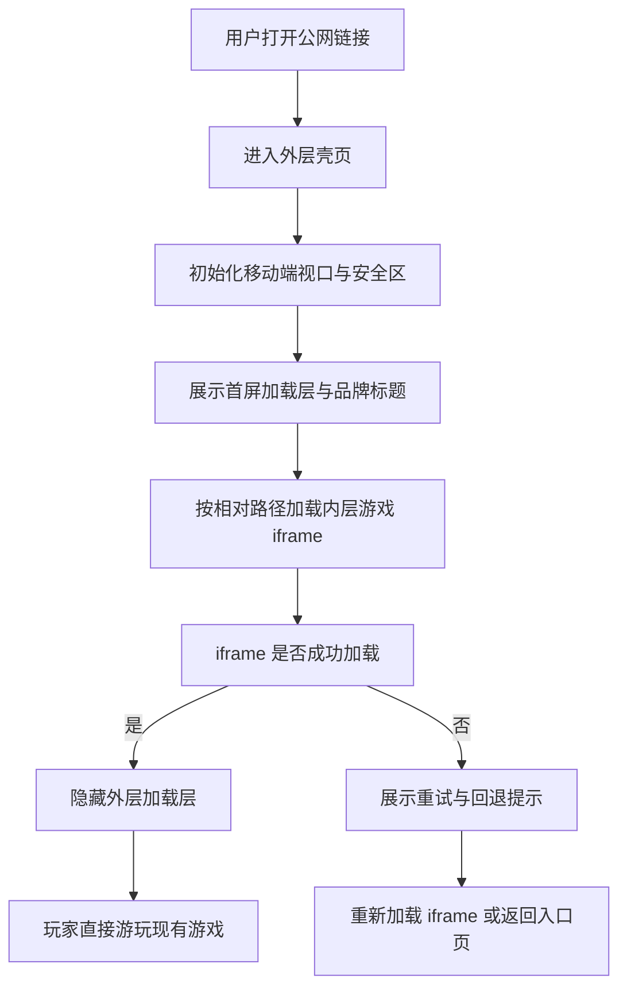

## 1. 产品概述
为现有 `02-project` 游戏新增一个纯静态外层网页壳页，使用 `iframe` 完整承载现有游戏产物；外层只负责移动端适配、标题图标、相对路径、访问稳定性与 Cloudflare Pages 部署，明确禁止改动游戏本体的代码、界面、样式、内容和功能。
- 目标用户为需要将现有本地可玩游戏快速发布到公网、并希望朋友通过手机浏览器或微信等移动端入口直接访问游玩的项目维护者。
- 产品价值在于通过“静态壳页 + 原游戏静态产物”的双层结构，把现有游戏封装成可直接上传到 Cloudflare Pages 的纯静态目录，同时降低公网访问时的路径异常、资源加载失败和移动端适配问题。

## 2. 核心功能

### 2.1 用户角色
当前版本仅包含单一维护者与普通访问者视角，无后台管理角色。

| 角色 | 进入方式 | 核心权限 |
|------|----------|----------|
| 访问玩家 | 打开公网链接 | 进入外层壳页、自动加载内层游戏、在手机或电脑中直接游玩 |
| 项目维护者 | 本地构建并上传 Cloudflare Pages | 配置标题图标、静态目录、相对路径与外层适配策略 |

### 2.2 功能模块
1. **外层壳页**：纯净加载页、品牌标题、浏览器图标、首屏 loading、网络兼容与移动端适配容器。
2. **游戏嵌入页**：通过 `iframe` 加载现有游戏，不直接改动游戏页面逻辑与样式。
3. **访问兼容层**：统一相对路径、视口参数、缓存策略、加载超时提示、iframe 回退策略。
4. **静态部署层**：Cloudflare Pages 目录结构、静态回退文件、资源路径修正、去除平台标识。

### 2.3 页面明细
| 页面名称 | 模块名称 | 功能描述 |
|-----------|-------------|---------------------|
| 外层入口页 | 头部元信息 | 配置自定义标题、描述、图标、移动端 viewport、PWA 相关 meta |
| 外层入口页 | 首屏加载层 | 展示品牌 loading、网络状态说明、资源加载进度与失败重试 |
| 外层入口页 | 自适应容器 | 根据屏幕尺寸、安全区、横竖屏状态自动计算 `iframe` 显示区域 |
| 外层入口页 | 游戏 iframe | 使用标准相对路径嵌入内层游戏，保证手机与桌面端一致展示 |
| 外层入口页 | 回退提示层 | 当内层游戏超时未就绪或资源异常时给出刷新、重试、备用入口 |
| 内层游戏页 | 保持现状 | 保持现有游戏逻辑、界面、样式、资源和路由行为不做业务改造 |
| 静态部署目录 | 发布规则 | 生成 Cloudflare Pages 可直接上传的纯静态目录与相对路径资源 |

## 3. 核心流程
维护者在本地先构建出原游戏静态产物，再生成独立的外层壳页静态目录。Cloudflare Pages 对外发布时，根入口先加载外层壳页，壳页完成移动端视口初始化、首屏 loading、路径修正和网络兼容处理，再通过相对路径加载内层游戏 `iframe`。当 `iframe` 成功载入后，壳页隐藏加载层并将交互交给内层游戏；若加载失败，则展示重试与回退提示，但不触碰游戏本体任何业务代码。

## 4. 用户界面设计
### 4.1 设计风格
- 主色：深蓝黑、石墨灰、金色微光，保持与现有塔罗题材一致但不覆盖内层游戏视觉
- 强调色：青蓝高亮与琥珀金，用于 loading、状态提示与交互按钮
- 按钮风格：轻量胶囊按钮，圆角较小，强调“壳层工具感”，避免抢夺游戏本体视觉
- 字体建议：标题使用有仪式感的中文展示字体，正文使用高可读的系统中文字体栈
- 布局风格：桌面优先、移动自适应；外层页面只保留必要信息区，中心完整让位给游戏内容
- 图标建议：使用纯净 favicon 与简洁品牌元素，不保留任何 Trae 标识、平台角标或默认模板信息

### 4.2 页面设计概览
| 页面名称 | 模块名称 | UI 元素 |
|-----------|-------------|-------------|
| 外层入口页 | 顶部元信息 | 自定义标题、favicon、主题色、Open Graph 基础信息 |
| 外层入口页 | 首屏加载层 | Logo、加载文案、轻量动效、网络异常提示、重试按钮 |
| 外层入口页 | 游戏容器 | 安全区 padding、最大宽度限制、等比缩放、iframe 圆角与阴影 |
| 外层入口页 | 辅助提示层 | 横屏建议、加载失败反馈、重新连接文案 |

### 4.3 响应式设计
- 采用桌面优先布局，同时完整覆盖 `320px` 至 `430px` 常见安卓与 iPhone 手机宽度。
- 外层容器适配 `safe-area-inset-*`，避免刘海屏、灵动岛、底部手势条遮挡。
- 在手机端优先以全屏游戏容器为主，壳层信息缩减为最小必要元素，避免压缩内层游戏可视区域。
- 对横屏与竖屏分别提供容器策略；若内层游戏更适合横屏，则壳层提供柔性横屏引导，但不阻断用户操作。
- 所有外层点击区最小触控面积不低于 `44px`。

## 5. 约束与范围
- 必须保证现有游戏逻辑、界面、样式、交互功能和页面布局不做任何业务层改造。
- 允许新增独立静态壳页目录、壳层资源、嵌入页面与部署说明，但不得侵入改写原游戏页面。
- 全站最终输出必须使用标准相对路径，不暴露任何本地绝对盘符或开发机路径。
- 必须去除 Trae 相关水印、模板标题、默认 favicon 与多余调试弹窗。
- 必须以 Cloudflare Pages 免费静态部署为目标，输出目录可直接上传，无需额外后端。

## 6. 成功标准
- 外层壳页可在电脑浏览器、安卓手机浏览器、iPhone Safari 中正常访问。
- 用户打开公网链接后，可在 3 秒内看到首屏壳页并开始加载内层游戏。
- `iframe` 内的游戏呈现与本地局域网 `http` 环境下观感一致，不出现新增样式覆盖。
- Cloudflare Pages 部署后可直接通过链接访问，无需下载文件、无需本地服务器、无需手动修改路径。
