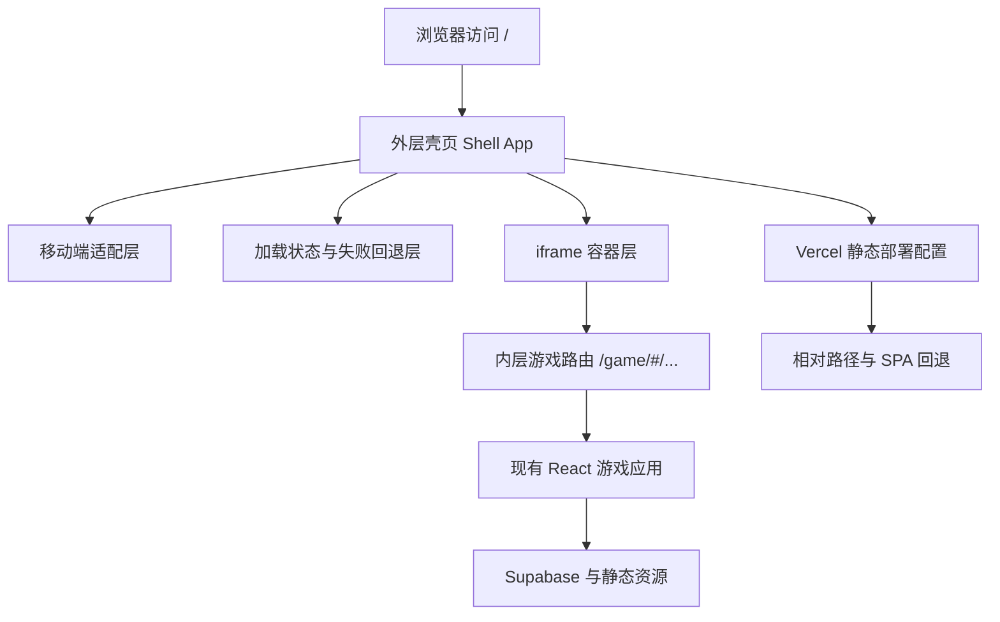

## 1. 架构设计


## 2. 技术说明
- 前端：React 18 + TypeScript + Vite + Tailwind CSS + Zustand
- 初始化工具：vite-init（沿用现有项目）
- 路由策略：外层使用公开入口路由，内层保留现有 HashRouter 游戏路由
- 部署方式：Vercel 静态站点自动构建
- 资源策略：全部改为标准相对路径，避免绝对盘符与开发机路径泄露
- 验证方式：`npm run check` + 本地预览 + 浏览器端 iframe 实测

## 3. 路由定义
| 路由 | 用途 |
|-------|---------|
| / | 外层壳页唯一公开入口，负责首屏加载、移动端适配、iframe 承载 |
| /game/ | 内层游戏静态承载入口，供 `iframe` 使用 |
| /game/#/auth | 内层登录页 |
| /game/#/lobby | 内层大厅页 |
| /game/#/play-local | 内层本地对战入口 |
| /game/#/battle | 内层战斗页 |

## 4. API 定义
当前方案不新增后端 API。
- 外层壳页只负责页面容器、加载状态、视口适配和 iframe 管理。
- 现有 Supabase、登录、房间、排行、对战逻辑全部继续由内层游戏原有代码负责。

## 5. 关键实现策略
### 5.1 双层结构拆分
- 新增 `Shell App` 作为公开入口，负责标题、图标、meta、loading、失败重试、iframe 容器。
- 现有游戏入口迁移到 `/game/` 承载路径下运行，避免壳层和游戏根节点冲突。
- 通过相对路径 `./game/` 或 `game/` 加载内层游戏，保证本地、预览、Vercel 一致。

### 5.2 移动端适配
- 外层页面在 `index.html` 中补全 `viewport`、`theme-color`、`apple-mobile-web-app-capable`、`format-detection` 等 meta。
- 使用 CSS 变量结合 `env(safe-area-inset-top/right/bottom/left)` 处理安全区。
- 通过 `ResizeObserver` 或窗口尺寸监听计算 iframe 容器尺寸，保持内容完整显示。
- 针对 iOS Safari 地址栏折叠、安卓浏览器视口抖动，优先使用 `100dvh` 与回退值组合。

### 5.3 公网访问稳定性
- 所有静态资源使用相对路径与 `base: "./"` 保持一致。
- 去除默认模板脚本、调试脚本和 Trae 相关角标插件，避免生产页面注入多余元素。
- 在 `vercel.json` 中增加 SPA 回退规则，保证深链访问不会 404。
- 为 `iframe` 设置清晰的 `loading`、`referrerPolicy`、`allow` 和错误超时处理。

### 5.4 标题、图标与品牌信息
- 更新根 `index.html` 标题、描述和 favicon。
- 新增标准 favicon 与移动端图标资源，统一品牌名。
- 不保留 `My Trae Project`、Trae badge、Trae 水印、默认模板信息。

### 5.5 性能优化
- 外层壳页首屏只加载最小必要 CSS/JS，避免外层过重影响打开速度。
- 利用 `iframe` 延后游戏主体启动，确保用户先看到可用加载界面。
- 静态资源使用 Vercel 默认 CDN 分发，并通过合理缓存头提升二次访问速度。
- 保持内层游戏资源不被壳层重复请求，避免双重渲染或重复初始化。

## 6. 数据模型
### 6.1 页面状态模型
```ts
interface ShellState {
  status: 'booting' | 'loading-frame' | 'ready' | 'timeout' | 'error'
  iframeUrl: string
  isMobile: boolean
  isLandscape: boolean
  frameLoaded: boolean
  lastErrorMessage: string | null
}
```

### 6.2 状态说明
- `booting`：壳页初始化阶段，准备 meta、尺寸、路径。
- `loading-frame`：已开始加载 `iframe`，等待内层游戏 ready。
- `ready`：`iframe` 成功载入，壳页仅保留最小外层结构。
- `timeout`：超过阈值仍未完成加载，提示用户重试。
- `error`：`iframe` 或资源加载失败，提示备用处理方式。

## 7. 模块设计
### 7.1 新增模块
- `src/pages/Shell.tsx`：外层壳页主入口。
- `src/components/shell/ShellFrame.tsx`：iframe 承载与生命周期管理。
- `src/components/shell/ShellLoading.tsx`：首屏加载层与失败重试。
- `src/hooks/useViewportFit.ts`：安全区与动态视口处理。
- `src/utils/shell.ts`：iframe 地址拼装、超时控制、移动端判断。

### 7.2 现有模块处理原则
- 现有游戏组件与页面只做路由挂载层调整，不改业务逻辑与视觉实现。
- 现有 `App.tsx` 游戏路由保留，必要时拆为 `GameApp.tsx` 供 `/game/` 入口复用。
- 现有 Supabase、状态管理、资源常量、战斗逻辑模块全部保持原职责。

## 8. Vercel 部署设计
### 8.1 部署规则
- `buildCommand` 继续使用 `npm run build`
- `outputDirectory` 继续使用 `dist`
- 新增 `rewrites`，确保根路由与 `/game/*` 路由都回退到对应入口文件
- 保证静态资源和 favicon 从 `dist` 内相对引用，不出现 `C:\` 等绝对路径

### 8.2 预期目录形态
| 路径 | 说明 |
|------|------|
| dist/index.html | 外层壳页入口 |
| dist/game/index.html | 内层游戏入口 |
| dist/assets/* | 共用静态资源 |
| dist/icons/* | 网站图标资源 |

## 9. 测试策略
- 路由验证：确认 `/` 与 `/game/` 均可本地与预览访问
- 响应式验证：覆盖安卓常见宽度、iPhone Safari、安全区和横竖屏切换
- 加载验证：确认 `iframe` 成功加载时外层 loading 自动隐藏，失败时出现重试
- 构建验证：执行 `npm run check` 与 `npm run build`
- 部署验证：Vercel 预览链接和正式域名均可直接打开外层壳页并进入游戏
